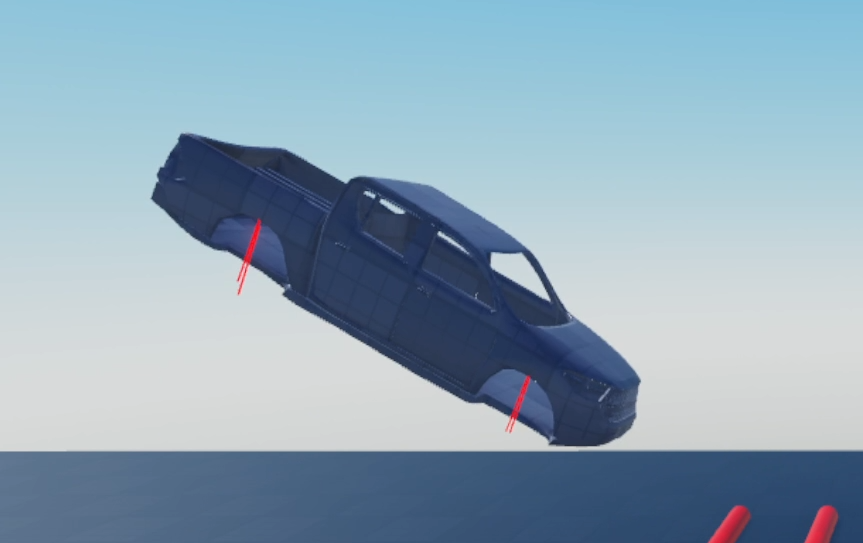

# 🚗 Project Hallucination

A semi-realistic, configurable vehicle chassis and suspension system.

**⚠️ Note:** This is a **reference implementation**—not yet tested for production use. It's ideal for learning, prototyping, or extending, but shouldn’t be used in live game environments without further testing.

